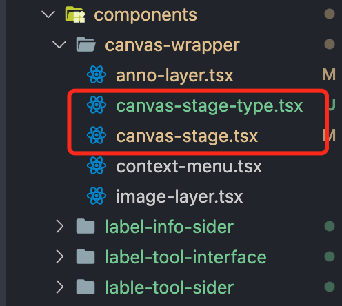

# README

## 一 项目文档

产品原型图链接地址：[产品原型图](https://16eel2.axshare.com)
设计图地址：[设计图](https://lanhuapp.com/url/qjlh7-jp1eQ)

## 二 项目安装

```txt
git clone https://git.hmatm.com/scm/ccbai/ccb-web-cv-tool.git
cd ccb-web-cv-tool

# 本地开发环境
npm run mock    # 启动本地 mock 数据
npm run start   # 启动本地 react 环境

# 远程开发环境：启动远程开发环境服务器
npm run dev


# 生产环境
npm run build
```

## 二 环境规范

### 2.1 vscode 插件安装

项目使用 ESLint 进行语法错误提示，使用 Prettier 进行风格控制校验，使用 Markdown 进行文档书写，env 文件负责环境控制，开发项目前情请先在 vscode 中安装以下插件：

- Eslint：代码错误提示插件
- Prettier：代码风格校验插件
- Editorconfig：统一不同开发工具代码风格插件
- `AutoCorrect`：自动添加英文、汉字空格
- `markdwonlint`：Markdown 格式化插件

其他非必要插件：

- `Markdown All in One`：负责 Markdown 格式标准工具
- `Markdown Preview Enhanced`：负责 Markdown 文件可视化
- `Markdown TOC`：Markdown 文件内链接跳转
- DotENV：负责 env 文件语法高亮

### 2.2 Git 提交规范

本项目 代码使用 npm 脚本命令提交，根据界面提示输入即可：

```txt
npm run commit
```

## 三 代码书写规范

所有声明必须书写注释。

### 3.2 interface 书写规范

所有 interface 定义以 `I` 开头，结尾为该接口性质：

```ts
export interface IUserModel {}

export interface ICheckModel extends IUserModel {}

export interface ILabelToolProps {}

export interface ILabelToolState {}
```

### 3.2 组件声明规范

组件声明方式：

```ts
interface IDemoProps {}

interface IDemoState {}

function Demo(props: IDemoProps) {}
```

若组件中传递的 props、state 过多，则在同目录层级中创建 后缀为 `-type` 的文件，如下所示：


