# CV lib 重要技术实现细节

## 一 图层与分组

### 1.1 分层分组涉及元素

图层与分组涉及到了旋转、缩放、拖拽三个方面。涉及这三个方面的地方有：

- 图片组：画布显示图片
- 图形组：所有绘制在画布中的简单标记图形

  - 复杂图形组：所有绘制在画布中的复杂标记图形，比如多边形：其本质是多边形、圆集合而成的一个新的分组。该图形本身也有统一拖拽、旋转、放大的需求，故而在一个独立分组组

- 上下文信息组：与简单图形组、复杂图形组一致拖拽，但不参与缩放、旋转

### 1.2 分层分组的划分

- stage：画布核心舞台

  - labelLayer：画布核心绘制层，包括简单图形组、复杂图形组、图片组、上下文信息组，负责以下组的**全局拖动**，**全局旋转**，**全局缩放**

    - shapeGroup：简单图形组
      - 各种自定义矩形、线条等
      - polygonGroup：多边形组（其中一个复杂图形组）
      - 其他复杂图形组
    - imageGroup：图片组

  - contextLayer：上下文绘制层，内部组件全部继承与一个矩形图形，实现上下文部分的：是否可显示，位置运算，是否可拖拽等接口规范
    - infoLabel：上下文信息组，负责 box 显示，比可拖拽，不参与缩放、旋转。在拖拽 shapeGroup、polygonGroup 时要实现该组对应拖拽

如图所示：



### 1.3 图形操作按钮

图形右键操作（显示操作按钮/显示批注输入框）不涉及旋转、缩放、拖拽等操作，所以其完全不依赖于 CV，且该部分由 canvas 内部绘制困难，故而交由外部项目绘制（原版 CVAT 也是这样涉及）。

## 二 CV 库核心扩展功能

### 2.1 数据同步扩展

CV 库内部存在一个 store 状态库，该库内部存储了当前帧中所有的图形引用代理：

```ts
{
  store: [
    { type: 'rectangle', w: 10, h: 10 },
    { type: 'pen', points: [11, 31, 12, 76] },
    { type: 'polygon', points: [11, 31, 12, 76], lines: [11, 31, 12, 76] },
  ]
}
```

我们在外部项目可以通过 CV 的实例 方法对 store 进行属性修改以实现图形的变化，但是这里有个很复杂的问题，即：该库将会被移植到其他任意技术栈的项目中使用，大部分项目是不可能出现外部数据与 CV 库数据格式完全相同的情况，那么作为项目业务开发者，在调用 CV 实例方法修改界面的同时，他有可能需要对项目中的状态进行修改，这是比较繁琐与多余的！

为了解决该问题，CV 库在初始化时可以传入一个回调函数，我们只需要将外部项目数据的变动方式写在该回调函数中，就可以在操作 CV 实例方法时候，不需要关心外部数据的状态变更。

针对本项目，其实现方式如下：

```ts
// 同步状态函数
const asyncExternal = (perceptionType: string, data: Annotation) => {
  console.log('外部 data:', data)
  // 将 cv 暴露出来的操作数据 同步给项目 store
  switch (perceptionType) {
    case 'add':
      store.add(data)
      break
    case 'change':
      store.change(data)
      break
  }
}

// new CV 对象时传入该函数
new CVCanvas({
  width: 1000,
  height: 500,
  container: 'container',
  annotations: list,
  asyncExternal,
})
```

此时在 CV lib 库中，内部发生状态改变的地方，直接执行该回调函数即可，比如：新建了一个图形：

```ts
// 舞台中新建了一个图形，触发内部 store 改变，同时也触发了外部数据的尾调用改变
@action
add(shape: Konva.Shape, shapeData: CVAnnotation, needAsyncExternal: boolean) {
  // 修改 CV 库状态
  this.list.push(shape)

    // 同步到外部
    if (needAsyncExternal) {
      console.log('发生同步-add:', shapeData)
      this.asyncExternal('add', shapeData)
    }
}
```

这样做，我们作为项目开发者，在开发时，更为直观，比如我们现在要实现一个功能：修改属性显示与隐藏，那么开发者只需要调用 `cv.show(shape_id)` 就能同时改变双边状态。

### 2.2 数据同步扩展--图形属性通用修改

案例：在项目中，点击锁按钮，实现某个图形的：可拖拽、不可拖拽，作为开发者只需要简单的调用如下方法即可：

```tsx
<div
  onClick={() => {
    let draggable = !store.list[0].draggable
    cv?.changeAttrs(store.list[0].shape_id, {
      draggable,
    })
  }}
>
  点击我切换拖拽
</div>
```

现在进入 CV lib 库内部观察 `changeAttrs` 的实现：

```ts
public changeAttrs(shape_id: number, attrs: CVAnnotation) {
          this.ctx.store.change({ ...attrs, shape_id: shape_id }, this.ctx)
        }
```

在上述代码中 `ctx.store.change()`进行状态改变，其具体执行体为：

```ts
@action
change(shapeData: CVAnnotation, ctx: ICVCtx) {
  const shape = this.find(shapeData.shape_id)
    if (shape) {
      // 修改 CV 库状态
      shape.setAttrs(shapeData)
      ctx.labelLayer.draw()

      // 同步到外部
      console.log('发生同步:change:', shapeData)
      this.asyncExternal('change', shapeData)
    }
}
```

我们回到外部同步函数中发现，执行的是 `change` 事件，对应外部 store 的 change 方法：

```ts
@action
change(attr: Annotation) {
  let shape = this.find(attr.shape_id)
    if (shape) {
      set(shape, attr)  // mobx 提供的 代理 set
    }
}
```

## 图形 ID

一个图形上有 2 个属性：

- annotationId：这个是服务端过来的唯一 ID，一般同步数据，与服务器交互用这个来判断图形，初始化 CV 的时候，外部传递到内部，cv 就自带了
- shape_id：这个是前端 konva 生成的图形 id，一般用来前端在界面上做一些非前后端交互性动作时候判断使用。这个初始化 CV 时，内部的 shapeGroup.render() 函数会生成，并同步到了外部。

## 业务解释

### 锁、图钉的作用

锁：
图形不能拖拽，形变，等操作；
且锁住之后，眼睛和图钉都不能操作了；

图钉：只是不能拖拽，可以形变，切换状态等
